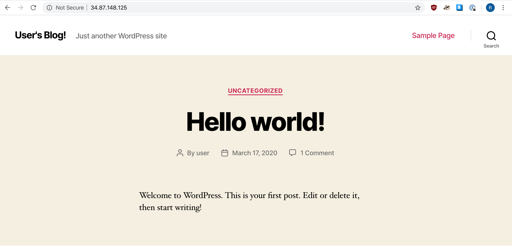
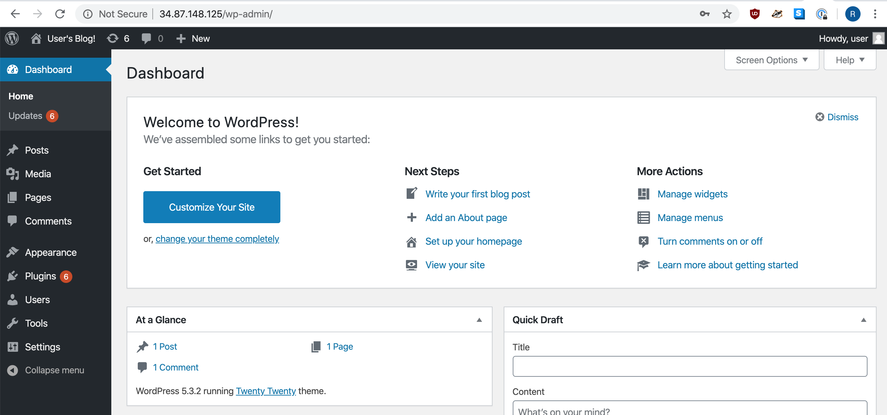

# Wordpress on GKE

This repository contains guides and its necessary files to setup a wordpress on GKE.
This setup will use GKE to host Wordpress and Google Cloud SQL for Wordpress database.

## Create a New Google Project

A project in Google Cloud is a logical grouping to easily manage cloud resources in one group.
This arrangement is also useful to consolidate cost for a certain project which make it easy to monitor.

1. Login to Google Cloud Console.
1. Go to Project selection > NEW PROJECT.
1. Enter project name and click the CREATE button.

## Create a Google Cloud SQL Instance for the engineering blog

1. Choose the newly created project on the project selection menu.
1. Click Nagivation menu > SQL.
1. Click the CREATE INSTANCE button > Choose MySQL.
1. Fill in Instance ID, Root password, and choose asia-southeast-1 for the region.
1. Click the Create button to initiate database instance creation.
   It'll take sometime for the database to be ready.
   Database public ip is available on the Cloud SQL dashboard.
1. Enable access to Cloud SQL
    1. Click the instance.
    1. Select the Connections menu.
    1. Click the Add network button.
    1. Fill in the Name field with public and the Network field with 0.0.0.0/0. It's not that secure but for testing purpose we'll allow access from anywhere.

After the database instance ready, let's create a new db schema for our Wordpress instalation.

1. Connect to our database instance using mysql client, `mysql -u root -p -h 34.87.88.170`. Replace 34.87.88.170 with out database public ip. You'll be prompted to input MySQL root password.
1. Create a database and dedicated user for it.
   ```sql
   create database wordpress;
   grant all privileges on wordpress.* to 'wordpress'@'%' identified by 'wordpresspassword'; # Replace wordpresspassword with your own password
   ```
1. Verify the newly created database and user, `mysql -u wordpress -p -h 34.87.88.170 -d wordpress`. You'll be prompted to enter wordpress user password.

## Create a GKE Cluster for the engineering blog

1. Go to Navigation menu > Kubernetes Engine > Clusters.
1. Click the Create cluster button.
1. Fill in the Name field with cluster name.
1. Choose Regional for The Location type and choose asia-southeast1 for the region.
1. Click the CREATE button to initiate GKE cluster creation.

We can also use the following command to create the cluster from a command line
```shell
gcloud beta container --project "wordpress-on-gke-271406" clusters create "wordpress-on-gke" --region "asia-southeast1" --no-enable-basic-auth --cluster-version "1.14.10-gke.17" --machine-type "n1-standard-1" --image-type "COS" --disk-type "pd-standard" --disk-size "100" --metadata disable-legacy-endpoints=true --scopes "https://www.googleapis.com/auth/devstorage.read_only","https://www.googleapis.com/auth/logging.write","https://www.googleapis.com/auth/monitoring","https://www.googleapis.com/auth/servicecontrol","https://www.googleapis.com/auth/service.management.readonly","https://www.googleapis.com/auth/trace.append" --num-nodes "3" --enable-stackdriver-kubernetes --enable-ip-alias --network "projects/wordpress-on-gke-271406/global/networks/default" --subnetwork "projects/wordpress-on-gke-271406/regions/asia-southeast1/subnetworks/default" --default-max-pods-per-node "110" --no-enable-master-authorized-networks --addons HorizontalPodAutoscaling,HttpLoadBalancing --enable-autoupgrade --enable-autorepair
```

We need to setup kubectl configuration file to interact with out Kubernetes cluster using command line.
The configu file itself can be set up using the following gcloud command.
```shell
gcloud container clusters get-credentials wordpress-on-gke --zone asia-southeast1-a --project wordpress-on-gke-271406
```
Replace **wordpress-on-gke** with your cluster name and **wordpress-on-gke-271406** with project name in which your cluster resides.

## Install Helm and Kubectl on deployer machine

Helm version 3 is preferred than Helm version 2 because in Helm 3 server side component of helm (known as Tiller) has been removed.
It's increase security posture for our Kubernetes cluster by reducing attack surface.
Helm is CLI application that can be installed using `brew install helm`. Please consult https://helm.sh/docs/intro/install/ for installation on other platforms.
Verify helm installation using `helm version`.
Here is the output of my machine deployer machine
```shell
version.BuildInfo{Version:"v3.1.1", GitCommit:"afe70585407b420d0097d07b21c47dc511525ac8", GitTreeState:"clean", GoVersion:"go1.13.8"}
```

Kubectl can be installed using `brew install kubectl` on Mac OS.
Please consult https://kubernetes.io/docs/tasks/tools/install-kubectl/ for other mechanism to install kubectl.
Here is kubectl version that I use for this guide
```shell
Client Version: version.Info{Major:"1", Minor:"15", GitVersion:"v1.15.5", GitCommit:"20c265fef0741dd71a66480e35bd69f18351daea", GitTreeState:"clean", BuildDate:"201
9-10-15T19:16:51Z", GoVersion:"go1.12.10", Compiler:"gc", Platform:"darwin/amd64"}
Server Version: version.Info{Major:"1", Minor:"14+", GitVersion:"v1.14.10-gke.17", GitCommit:"bdceba0734835c6cb1acbd1c447caf17d8613b44", GitTreeState:"clean", Build
Date:"2020-01-17T23:10:13Z", GoVersion:"go1.12.12b4", Compiler:"gc", Platform:"linux/amd64"}
```

## Setup Wordpress on Kubernetes

After setup Helm, Kubectl, and Kubernetes cluster, we are ready to deploy Wordpress.
We are going to use the Wordpress helm chart provided by Bitnami.

1. Adjust the following config inside `blog-up.sh`
   ```shell
   externalDatabase.host=34.87.88.170 # DB host
   externalDatabase.user=wordpress # DB username
   externalDatabase.password=wordpresspassword # DB password
   externalDatabase.database=wordpress # DB Name
   ```
1. Run `./blog-up.sh`. Here is example output when this script running successfully
   ```shell
   WordPress URL: http://34.87.148.125/
   WordPress Admin URL: http://34.87.148.125/admin
   Wordpress Username: user
   Wordpress Password: KAJz7fca50
   ```

Here is screenshot of Wordpress landing page and wp-admin page that has been successfully created
- Landing page 
- Admin page 

## Scaling the Wordpress installation

We can scale up or down Wordpress pod using the `blog-resize.sh` script.
For example, run `./blog-resize.sh 3` to set capacity to be 3x baseline.